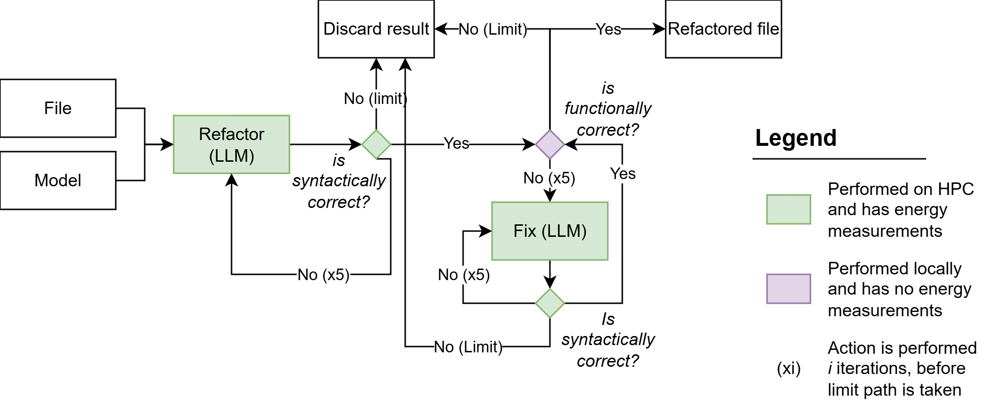

# Master Thesis - Framework

[](https://github.com/ThijsJ04/MasterThesis/blob/main/LICENSE)
[](https://www.python.org/downloads/release/python-31213/)

_This repository is created and validated on Ubuntu 24.04 LTS with Python 3.12._

## Project Structure

### Repository Analysis

Located under `src/analysis/`. This module can perform two functions: static analysis of PHP codebases and workload profiling of PHP codebases. Static analysis consists of an analyzer and a parser. Given the location of the PHP codebase, the analyzer will set up a Docker environment and execute [PHP Depend](https://pdepend.org/), [PHP_CodeSniffer](https://github.com/squizlabs/php_codesniffer), [PHPMD](https://phpmd.org/), and [PhpMetrics](https://www.phpmetrics.org/). The results are stored in the local `.../outputs/raw_output` directory. The parser can then be used to parse the raw output into the following CSV format:

```
file_path,method_name,start_line,end_line,cc,mi,halstead_difficulty,amount_of_phpmd_violations,phpmd_violations
```

and stored in the `.../outputs/parsed_output` directory. The current main function of the parser uses only PHP Depend and PHPMD results.

Workload profiling can be used to find out how often each function is called in a PHP codebase. The `README.md` file in this directory explains how to set up Xdebug and execute the PHP codebase with the correct Xdebug configuration to generate the correct Xdebug trace. The accompanying `parse_xdebug_trace.py` file can then be used to parse the Xdebug trace into JSONL format, which is stored in the `workload_profile/outputs` directory. The JSONL format shows how often each function is called:

```
{"count": 1, "function_name": "function_name"}
```

### Energy Consumption Measurements
Located under `src/measure_energy/`. This module consists of components, one to measure energy consumption of the CPU and one to measure energy consumption of a NVIDIA GPU. The CPU energy consumption is determined using a pre-trained model named [Cloud Energy](https://github.com/green-coding-solutions/cloud-energy) developed by [Green Coding Solutions](https://github.com/green-coding-solutions). The subdirectory in question contains a separate README file that explain the process in more details.

The energy consumption of a NVIDIA GPU is measured using the [NVIDIA Management Library (NVML)](https://developer.nvidia.com/nvidia-management-library-nvml). The function used from the library is [nvmlDeviceGetTotalEnergyConsumption](https://docs.nvidia.com/deploy/nvml-api/group__nvmlDeviceQueries.html#:~:text=nvmlDeviceGetTotalEnergyConsumption). This function return the total energy consumption of the GPU in millijoules (converted to Joules in the code) since the last boot. To measure the energy consumption of a specific task, the total energy consumption is measured before and after the task, and the difference is calculated to get the energy consumption of the task.

### Code Refactoring

Located under `src/refactoring/`. This module contains the necessary code to make calls to a language model and verify the correctness of the output. The current verification is built based upon PHP code.

To make calls to a language model, a handler needs to be setup. The current module has handlers for Ollama and vLLM. You can make your own handler based on the provided interface.

Making use of the handlers, are the agents, and these agents are meant to be used in a pipeline (see figure below), but work independently. The agents are the following:
- **Refactor agent**: This agent is responsible for refactoring the code. It takes in a code file and a prompt, and it returns the refactored code.
- **Verification agent**: This agent is responsible for verifying the correctness of the refactored code. It takes in the refactored code and a _verifier_, which is a function that can verify the correctness of the code.
- **Fix agent**: This agent is responsible for fixing the code if the verification agent determines that the code is incorrect. It takes in the refactored code, the feedback from the verification agent, and a prompt, and it returns the fixed code.



Each agent can be called using the written runner in `src/runner.py`. The runner also defines the following configurational parameters which must be provided by the user.
- `TARGET_REPOSITORY`: The root of the repository that needs to be refactored.
- `FOLDER_TO_REFACTOR`: The folder in the repository that is to be refactored. This can be the same as `TARGET_REPOSITORY` if the entire repository is to be refactored.
- `PROGRAMMING_LANGUAGE`: The programming language of the code snippets that are being refactored.
- `OUTPUT_DIR`: The directory where the results of all agents will be stored.

## Developer setup

- Setup virtual environment:

```bash
python3 -m venv venv
source venv/bin/activate
pip install -r requirements.txt
```

- Setup pre-commit hooks:

```bash
pre-commit install
```

- Execute pytest:

```bash
pytest
```
