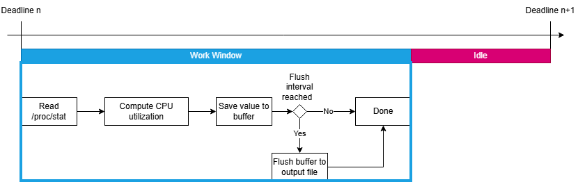
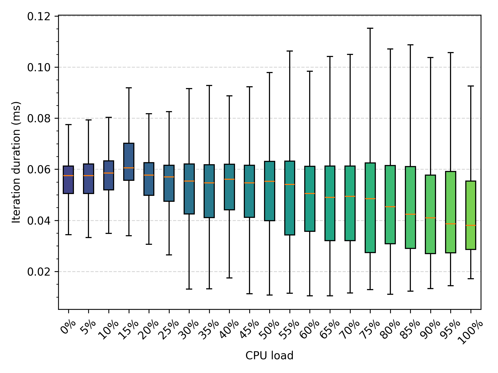
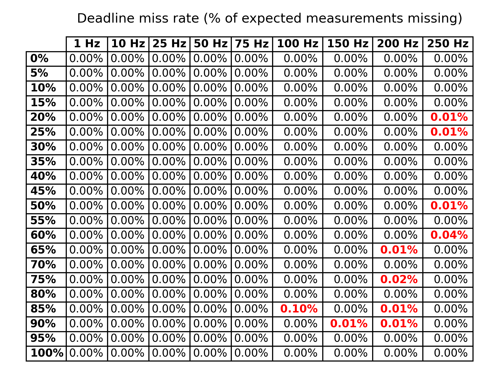
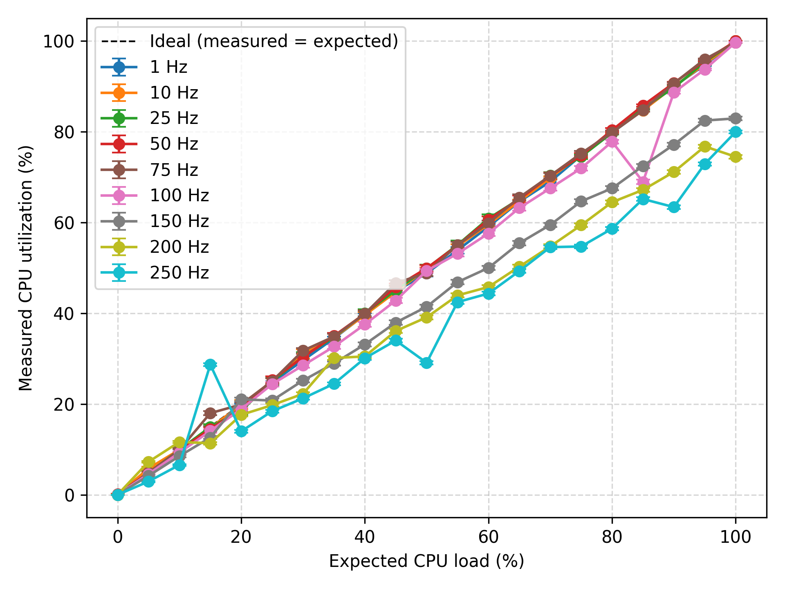

# Measuring Energy Consumption using CPU Utilization

## Measuring CPU utilization



The CPU measurements are performed on an interval, which is defined in Hertz (Hz). As an example, an interval of 100Hz means that the CPU utilization is measured every $\frac{1}{100}$ seconds, or every 10ms. Within the given interval the program performs several operations (performed within what is defined the work window), which are outlined in the figure above. If the program is done before the next interval, it will sleep until the next interval starts. If the program is not done before the next interval, it will notice a deadline miss and skip the next interval (see figure below).


Within the work window, the program reads the CPU utilization from the /proc/stat file. The /proc/stat file contains various kernel system statistics, including time spend by the CPU in various modes (retrieved from [Linux manual page](https://man7.org/linux/man-pages/man5/proc_stat.5.html)). The first line of the /proc/stat file contains the aggregate CPU times across all cores, which is what the program reads. The actual CPU utilization is computed by taking two separate readings of the CPU and the formula:

$$\text{CPU Utilization} = 100\%\cdot\frac{\Delta \text{Compute Time}}{\Delta\text{Compute Time}+\Delta\text{Idle Time}}$$

The CPU utilization is stored together with a UNIX timestamp in the output log file, which is a CSV file with the following format:

```
UNIX timestamp | CPU utilization (%)
```

To reduce latency, the utilization is not written every interval, but every predefined number of intervals, which is defined as the flush interval.

### Running the CPU utilization logger

The CPU utilization logger is precompiled using

```bash
gcc -O3 -o cpu_util_logger cpu_util_logger.c
```

you can run the compiled version of the CPU utilization logger with the
following command:

```bash
./cpu_util_logger
```

The program will have three early exit conditions:
1. The program cannot open the log file for writing.
2. The program cannot read the CPU utilization from the proc file.
3. The proc file is malformed or the file cannot be parsed correctly.

The program runs indefinitely until it receives a shutdown signal (SIGINT or SIGTERM). When the program receives a shutdown signal, it will flush and close the log file if it's open, and then exit gracefully.

## Experiments on the CPU utilization logger

Three experiments were performed on the CPU utilization logger to evaluate its performance and behavior under different conditions:
1. **Logging delay**: This experiment measures how long each work iteration of the CPU utilization logger takes in terms of wall clock time. This determines the overhead of the logger.
2. **Deadline misses**: This experiment evaluates whether the CPU utilization logger misses deadlines, i.e., whether it logs at the expected frequency defined by the Hz parameter. The amount of deadline misses is determined by comparing the amount of logged samples to the expected amount of samples based on the duration of the experiment and the Hz parameter.
3. **Utilization accuracy** (weak): A weakly defined experiment that evaluates whether the logged CPU utilization values are somewhat accurate. For this the CPU is stressed with `stress-ng` at different levels of CPU utilization, and the logged CPU utilization values are compared to the expected CPU utilization values based on the stress level. It is defined weak as `stress-ng` does not guarantee that the CPU utilization will be exactly at the expected level.

### Running the experiments for the CPU utilization logger

To run the experiments three files have been created: `experiments/test_cpu_util_logger.c`, `experiments/run_test_cpu_util_logger.sh`, and `experiments/parse_outputs.py`.

`test_cpu_util_logger.c` is an almost direct copy of `cpu_util_logger.c` but it is setup to be used in experiments. The differences are:
- An extra program parameter is included: EXPERIMENT_DURATION_SECONDS, which defines how long the program should run. In contrast to the original, this program will stop after the defined duration, instead of running indefinitely.
- The log file format is changed to include work_ns, which is the time it took to perform the work in each interval.

`run_test_cpu_util_logger.sh` is a script that compiles the modified CPU utilization logger, runs it with different target CPU utilizations and Hz values, and stores the results in separate log files for each target combination. The script uses `stress-ng` to stress the CPU at different levels of CPU utilization.

To define the maximum Hz value for the experiments, the refresh frequency of /proc/stat can be checked by running the following command:

```{bash}
~$ grep CONFIG_HZ /boot/config-$(uname -r)
# CONFIG_HZ_PERIODIC is not set
# CONFIG_HZ_100 is not set
CONFIG_HZ_250=y
# CONFIG_HZ_300 is not set
# CONFIG_HZ_1000 is not set
CONFIG_HZ=250
```

As can be seen from the output, the refresh frequency of /proc/stat is 250Hz. Higher frequencies do not make sense to test, as the logger will extract the same values from /proc/stat.

`parse_outputs.py` is a script that parses the log files generated by `run_test_cpu_util_logger.sh`. The script generates a graph for experiment 1 (logging delay) and experiment 3 (utilization accuracy), and it generates a table for experiment 2 (deadline misses).

### Results of the experiments for the CPU utilization logger

The `run_test_cpu_util_logger.sh` script is ran on Debian 13 (20260316-2418) via HVM on x86 via an AWS EC2 t3.micro instance. CPU utilization targets were set at 5% intervals from 0% to 100% and Hz targets were set to [1, 10, 50, 75, 100, 150, 200, 250]. The program was ran for 1 minute for each target combination.

After SSHing into the instance, the `run_test_cpu_util_logger.sh` script was started with the following command:

```bash
nohup ./run_test_cpu_util_logger.sh > output.log 2>&1 &
```

after which the SSH session was closed. The session was opened again after all tests were completed to retrieve the results.

After parsing the outputs from the experiments with `parse_outputs.py`, the following results were obtained:





From the results it can be observed that, firstly, the logging delay stays generally consisting across different target CPU utilizations and is generally below 0.06ms, with exceptions between 0.10ms and 0.12ms. Secondly, there no deadlines have been missed up till 100Hz. From 150Hz we received 0.01-0.04% deadline misses. With 100Hz and 85% CPU utilization the deadline miss rate spiked to 0.10%, but seeing the general trend of the results, this is likely an outlier. Lastly, it can be seen that up till 100Hz, the logged CPU utilization values are generally accurate. From 150Hz and higher, the logged CPU utilization values start to deviate from the expected values, with the deviation increasing as the Hz value increases. From the graph it follows that 100Hz is the preferred Hz value.

## Converting CPU utilization to energy consumption

To convert CPU utilization to energy consumption, [Cloud Energy](https://github.com/green-coding-solutions/cloud-energy) is used. Cloud Energy is a local trainable and runnable ML model based on XGBoost that can estimate power consumption (W) from CPU utilization (%). The creators are [ArneTR](https://github.com/ArneTR), [ribalba](https://github.com/ribalba), and [dan-mm](https://github.com/dan-mm). Cloud Energy is licensed under the MIT license.

Cloud Energy is setup as a Git submodule. Initialize and update the submodule with the following commands:

```bash
git submodule init
git submodule update
```

For usage and further information on Cloud Energy, please refer to the [Cloud Energy README](https://github.com/green-coding-solutions/cloud-energy/blob/main/README.md).

In short, to convert CPU utilization to energy consumption, the pretrained model (`xgb.py`) can be used:

```bash
cat your_cpu_utilization_list.txt | python3 xgb.py ...[optional parameters]
```
